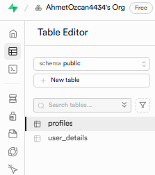
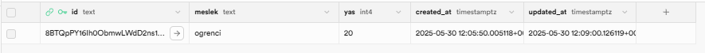
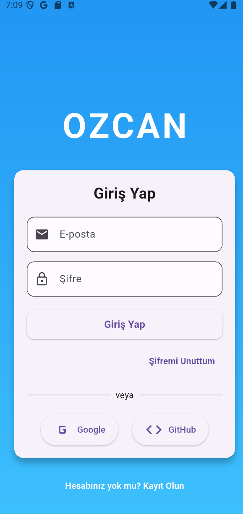
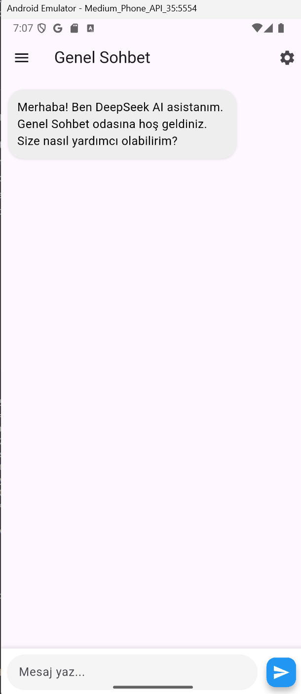
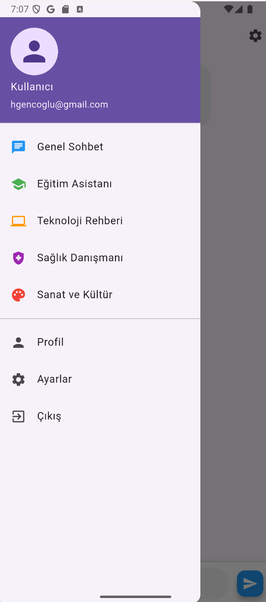
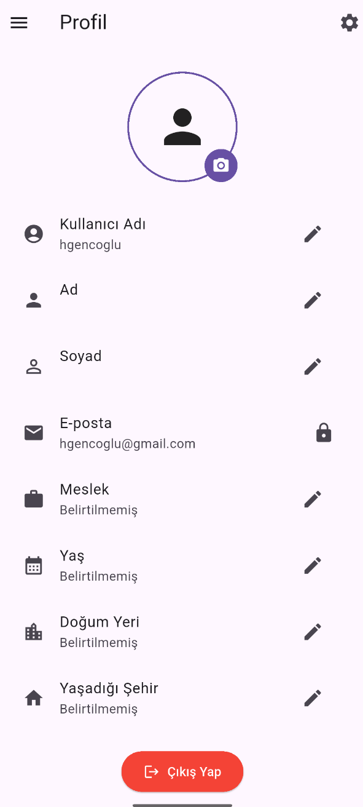
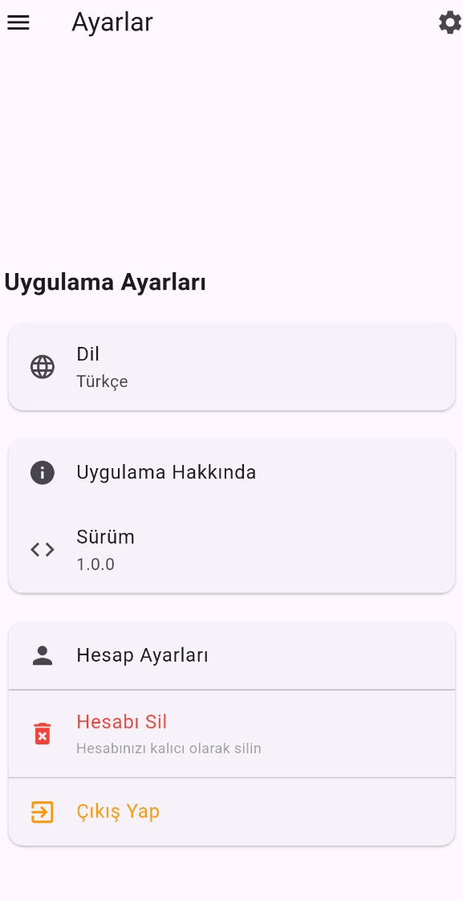

# Özcan Proje - Mobil Uygulama Dersi Projesi

Bu proje, mobil programlama dersi vize projesi olarak Flutter framework'ü kullanılarak geliştirilmiştir. Android, Windows, Web ve iOS platformlarını desteklemektedir.

## 📱 Projenin Amacı

Kullanıcıların hesap oluşturabileceği, güvenli giriş yapabileceği ve AI destekli sohbet edebileceği modern bir mobil uygulama geliştirmek. Uygulama, çoklu veri saklama yöntemlerini entegre ederek kapsamlı bir kullanıcı deneyimi sunar.

## 🛠️ Teknoloji Stack'i

### Ana Teknolojiler
- **Flutter**: Cross-platform mobil uygulama geliştirme
- **Firebase Authentication**: Kullanıcı kimlik doğrulama (Email/Password, Google, GitHub)
- **Firebase Firestore**: NoSQL veritabanı
- **Supabase**: PostgreSQL veritabanı ve storage
- **SQLite**: Yerel veritabanı
- **SharedPreferences**: Yerel depolama
- **TogetherAPI & DeepSeek-V3**: AI chatbot entegrasyonu

## 📁 Proje Yapısı

```
lib/
├── main.dart                    # Ana uygulama giriş noktası
├── screens/                     # Uygulama ekranları
│   ├── login.dart              # Giriş ekranı
│   ├── forgot_password.dart    # Şifre sıfırlama
│   ├── register.dart           # Kayıt ekranı
│   ├── home.dart               # Ana sayfa (AI Chatbot)
│   ├── profile.dart            # Profil sayfası
│   ├── settings.dart           # Ayarlar sayfası
│   ├── about.dart              # Hakkında sayfası
│   └── pages.dart              # Özelleştirilmiş sohbet sayfaları
├── widgets/                     # UI bileşenleri
│   ├── base_page.dart          # Temel sayfa şablonu
│   ├── custom_app_bar.dart     # Özel AppBar bileşeni
│   └── drawer.dart             # Özel Drawer menüsü
└── services/                    # Veri ve API servisleri
    ├── auth_service.dart       # Kimlik doğrulama servisi
    ├── database_service.dart   # SQLite servisi
    ├── preferences_service.dart # SharedPreferences servisi
    └── supabase_service.dart   # Supabase servisi
```

## 🔄 Veri Yönetimi Stratejisi

### Firebase Authentication
- Kullanıcı kimlik doğrulama ve oturum yönetimi
- OAuth sağlayıcıları: Google, GitHub
- Metadata: UID, email, displayName, photoURL

### Firebase Firestore
**`users` Koleksiyonu:**
```json
{
  "id": "8BTQpPY16Ih0ObmwLWdD2ns1AEe2",
  "name": "Ahmet",
  "surname": "Ozcan", 
  "email": "ahmetfemozcan@gmail.com",
  "birthPlace": "İstanbul",
  "currentCity": "İstanbul",
  "birthDate": "2000-01-01T00:00:00.000Z",
  "createdAt": "2025-06-17T15:22:14.034Z"
}
```

### Supabase PostgreSQL
**`profiles` Tablosu:**
```sql
CREATE TABLE profiles (
  id TEXT PRIMARY KEY,
  kullanici_adi TEXT NOT NULL,
  ad TEXT NOT NULL,
  soyad TEXT NOT NULL,
  eposta TEXT NOT NULL UNIQUE,
  foto TEXT,
  dogum_tarihi DATE,
  dogum_yeri TEXT,
  yasadigi_sehir TEXT,
  created_at TIMESTAMPTZ DEFAULT CURRENT_TIMESTAMP
);
```

### SQLite (Yerel Veritabanı)
```sql
CREATE TABLE profile(
  id TEXT PRIMARY KEY,
  name TEXT,
  surname TEXT,
  email TEXT,
  birthDate TEXT,
  birthPlace TEXT,
  currentCity TEXT,
  profession TEXT,
  age INTEGER,
  photoUrl TEXT
)
```

### SharedPreferences
```dart
{
  'uid': '8BTQpPY16Ih0ObmwLWdD2ns1AEe2',
  'email': 'ahmetfemozcan@gmail.com',
  'displayName': 'Ahmet Özcan',
  'isLoggedIn': 'true',
  'lastLoginTime': '2025-06-02T22:06:47.000Z'
}
```

## 📱 Uygulama Ekranları

### 1. Giriş Ekranı (`login.dart`)
- Email/şifre ile giriş
- Google ve GitHub OAuth entegrasyonu
- Şifre sıfırlama
- Kayıt sayfasına yönlendirme

### 2. Kayıt Ekranı (`register.dart`)
- Email, şifre ve kullanıcı adı ile kayıt
- Şifre doğrulama
- Otomatik profil oluşturma

### 3. Ana Sayfa (`home.dart`)
- AI Chatbot entegrasyonu
- Gerçek zamanlı mesajlaşma
- Mesaj geçmişi

### 4. Özelleştirilmiş Sohbet Sayfaları (BasePage Implementation)

BasePage üzerinden türetilen 5 farklı tema sohbet sayfası:
- **Page1 - Genel Sohbet** (Mavi tema)
- **Page2 - Eğitim Asistanı** (Yeşil tema)
- **Page3 - Teknoloji Rehberi** (Mor tema)
- **Page4 - Sağlık Danışmanı** (Kırmızı tema)
- **Page5 - Sanat ve Kültür** (Turuncu tema)

#### Chat Sayfaları Implementasyonu
```dart
class ChatPage extends StatefulWidget {
  @override
  Widget build(BuildContext context) {
    return BasePage(
      title: widget.title,
      body: Column(
        children: [
          Expanded(child: ListView.builder(...)), // Mesaj listesi
          Container(...),                         // Mesaj gönderme alanı
        ],
      ),
    );
  }
}
```

### 5. Profil Sayfası (`profile.dart`)
- Profil fotoğrafı yönetimi
- Kişisel bilgi güncelleme
- Veri senkronizasyonu

#### Profil Sayfası Implementasyonu
```dart
class ProfilePage extends StatefulWidget {
  @override
  Widget build(BuildContext context) {
    return BasePage(
      title: 'Profil',
      body: SingleChildScrollView(
        child: Column(
          children: [
            Stack(...),          // Profil fotoğrafı
            ListTile(...),       // Kullanıcı bilgileri
            ElevatedButton(...), // Çıkış butonu
          ],
        ),
      ),
    );
  }
}
```

### 6. Ayarlar Sayfası (`settings.dart`)
- Profil ayarları
- Hesap bilgileri
- Yardım ve hakkında
- Çıkış yapma

## 🗄️ Supabase Veritabanı Şeması

Projenin Supabase veritabanı şeması aşağıdaki gibi tasarlanmıştır:


### Tablo Yapıları

Supabase veritabanında aşağıdaki tablolar bulunmaktadır:



#### 1. `profiles` Tablosu
```sql
CREATE TABLE IF NOT EXISTS profiles (
  kullanici_adi TEXT NOT NULL,
  eposta TEXT NOT NULL,
  foto TEXT
);
```

**Alanlar:**
- `kullanici_adi` (TEXT, NOT NULL): Kullanıcının tam adı
- `eposta` (TEXT, NOT NULL): Kullanıcının e-posta adresi
- `foto` (TEXT): Profil fotoğrafının URL'si


#### 2. `user_details` Tablosu
Kullanıcı detayları (meslek, yaş) için tablo:



**Özellikler:**
- Row Level Security (RLS) etkin
- Authenticated kullanıcılar INSERT/UPDATE yapabilir
- Herkese SELECT yetkisi var

#### 3. Storage Bucket - `profile_photos`
Profil fotoğrafları için özel storage bucket:
- **Bucket ID**: `profile_photos`
- **Public Access**: Etkin
- **Upload Policy**: Authenticated kullanıcılar yükleyebilir
- **View Policy**: Herkes görüntüleyebilir

### Güvenlik Politikaları (RLS Policies)

#### Profiles Tablosu İçin:
```sql
-- Kullanıcılar profil ekleyebilir
CREATE POLICY "Users can insert profiles"
ON profiles FOR INSERT
TO authenticated
WITH CHECK (true);

-- Kullanıcılar profil güncelleyebilir
CREATE POLICY "Users can update profiles"
ON profiles FOR UPDATE
TO authenticated
USING (true);

-- Herkes profilleri görüntüleyebilir
CREATE POLICY "Anyone can select profiles"
ON profiles FOR SELECT
TO anon, authenticated
USING (true);
```

#### Storage İçin:
```sql
-- Herkes profil fotoğraflarını görüntüleyebilir
CREATE POLICY "Anyone can view profile photos"
ON storage.objects FOR SELECT
TO anon, authenticated
USING (bucket_id = 'profile_photos');

-- Kullanıcılar profil fotoğrafı yükleyebilir
CREATE POLICY "Users can upload profile photos"
ON storage.objects FOR INSERT
TO authenticated
WITH CHECK (bucket_id = 'profile_photos');

-- Kullanıcılar profil fotoğrafını güncelleyebilir
CREATE POLICY "Users can update profile photos"
ON storage.objects FOR UPDATE
TO authenticated
USING (bucket_id = 'profile_photos');
```

### Veri Entegrasyonu

Supabase veritabanı, diğer veri saklama çözümleri ile entegre çalışır:

1. **Firebase Firestore** → Supabase: Kullanıcı kayıt sırasında profil bilgileri
2. **Supabase** → SQLite: Oturum açma sonrası yerel veritabanına senkronizasyon
3. **SharedPreferences**: Oturum bilgileri ve hızlı erişim için

Supabase kurulumu için `supabase_setup.sql` dosyasındaki SQL sorgularını çalıştırın.

## 🔒 Güvenlik

### Firebase Security Rules
```javascript
rules_version = '2';
service cloud.firestore {
  match /databases/{database}/documents {
    match /users/{userId} {
      allow read, write: if request.auth != null && request.auth.uid == userId;
    }
  }
}
```

### Supabase RLS Policies
```sql
-- Kullanıcılar sadece kendi profillerini görebilir
CREATE POLICY "Users can view own profile"
ON profiles FOR SELECT
TO authenticated
USING (auth.uid() = id);

-- Kullanıcılar sadece kendi profillerini güncelleyebilir
CREATE POLICY "Users can update own profile"
ON profiles FOR UPDATE
TO authenticated
USING (auth.uid() = id);
```

## 🚀 Kurulum

### Gereksinimler
- Flutter SDK (≥ 3.0.0)
- Dart SDK (≥ 2.18.0)
- Android Studio veya VS Code
- Firebase Account
- Supabase Account

## 📸 Ekran Görüntüleri






